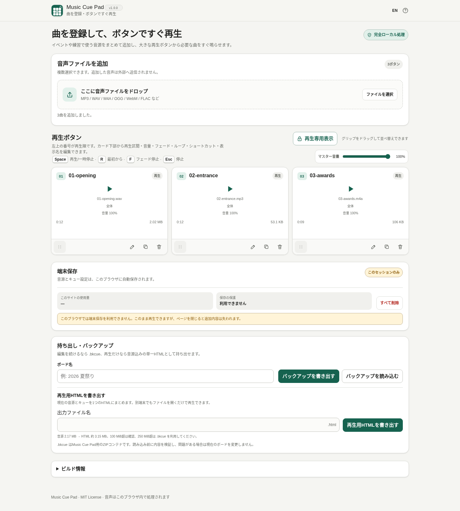

# Music Cue Pad

[](https://github.com/ttomohisa/htmlapps-music-cue-pad/actions/workflows/deploy-pages.yml)
[](LICENSE)
[](https://ttomohisa.github.io/htmlapps-music-cue-pad/)

[English README](README.md)

Music Cue Pad は、複数の音声ファイルを登録し、大きな再生ボタンから必要な曲をすぐ鳴らせる、完全ローカル処理のキュープレイヤーです。選択した音声はアプリからサーバーへアップロードしません。

## 🚀 Live demo

### [GitHub Pages で Music Cue Pad を開く](https://ttomohisa.github.io/htmlapps-music-cue-pad/)

GitHub Pages から最初のHTMLを読み込んだ後、音声の読み込み、再生区間設定、再生、端末保存、バックアップ、再生用HTML書き出しは端末内で処理します。選択した音声ファイルをこのアプリから外部へ送信しません。

[](https://ttomohisa.github.io/htmlapps-music-cue-pad/)

## Features

- **登録した曲をすぐ再生** — 複数の音声ファイルを追加し、番号付きの大きな再生ボタンから必要な曲を鳴らせます。
- **再生区間を直接調整** — 2つまみの区間バーで開始 / 終了を動かし、試聴しながらシークしたり、`1:23.500` のような時刻を直接入力したりできます。
- **元ファイルを変更せずキューごとに設定** — キュー別音量、Fade In / Fade Out、Loop、任意の再生ショートカットを設定できます。
- **ポインターでもキーボードでも並べ替え** — グリップをドラッグすると移動先と仮の番号が更新されます。Tabでグリップを選び、↑ / ↓キーで1つずつ移動することもできます。
- **再生だけに集中できる表示** — 編集操作を隠して再生ボタンを大型化し、残り時間を確認できます。対応環境では全画面表示 / 画面点灯維持も利用できます。
- **次の曲を手動で再生** — 下部プレイヤーに次のキュー名を表示し、ボードの順に再生できます。未選択なら先頭から、停止・終了後は次の曲へ進みます。自動送り・折り返し・再生できない曲のスキップはありません。書き出した再生用HTMLでも使えます。
- **すばやい再生操作** — 一時停止 / 再開、先頭から、Fade Stop、即時停止、マスター音量、キュー別ショートカット、PCキーボード操作に対応します。
- **この端末へ自動保存** — 音源、キュー設定、ボード名、マスター音量をIndexedDBへ保存し、再読み込み後に復元します。
- **編集可能なボードを持ち運び** — 音源と設定を含む `.bkcue` を書き出し / 読み込みできます。
- **再生専用の単一HTMLを書き出し** — 現在の音源とキュー設定を1つの `.html` に内包し、編集画面なしで別端末へ渡せます。
- **完全ローカル処理・単一HTML** — アカウント、実行時CDN、Analytics、Telemetry、API、外部フォントを必要としません。
- **日本語 / 英語** — 同じHTML内で切り替えられます。

## Quick start

### Web版を使う

[デモを開く](https://ttomohisa.github.io/htmlapps-music-cue-pad/)だけで利用できます。インストールやアカウント登録は不要です。

### 単一HTMLを使う

1. Releaseの `music-cue-pad.html`、またはこのリポジトリの `dist/index.html` を用意します。
2. 現行ブラウザで開きます。
3. 音声ファイルを追加して再生ボードを作ります。

### ローカルで単一HTMLを生成する

1. このリポジトリをダウンロードまたはcloneします。
2. Windowsで `build-standalone.bat` をダブルクリックします。
3. 生成された `dist/index.html` または `dist/index.self-extract.html` を必要な場所へコピーします。
4. Music Cue Padのインストールなしで、そのHTMLを直接開いて使えます。

通常ビルドでは追跡対象の `music-cue-pad.html` も更新します。`-OutputPath` を明示したビルドでは変更しません。ソース編集後は通常ビルドを行ってから `scripts/check-repository.ps1` を実行してください。チェックは古いルート成果物を検出し、開発用のNode.jsテストを実行します。

現在のアプリには第三者ランタイム依存はありません。通常利用にPython、Node.js、ローカルWebサーバーは不要です。

## Usage

1. ファイル選択またはDrag & Dropで音声を1つ以上追加します。
2. 音声ごとに番号付きの再生ボタンが作られます。ボタンを押すと再生し、別のボタンを押すとそのキューへ切り替わります。
3. **キューを編集**から名前、Start / Endを設定します。「位置を確認」では2つまみの区間バーをドラッグするか、正確な時刻を入力できます。
4. 必要に応じてキュー音量、Fade In、Fade Out、Loop、再生ショートカットを設定します。
5. カードのグリップをドラッグするか、Tabでグリップを選び↑ / ↓キーで並べ替えます。同じキューにフォーカスが残り、先頭と末尾は折り返しません。Escでドラッグを取り消し、選択中のキューがあれば即時停止します。順番を変えずに離しても削除のUndoは消えません。
6. キュー一覧上部のマスター音量と、画面下部のプレイヤーからシーク、一時停止 / 再開、Fade Stop、即時停止を操作します。
7. 再生に集中したいときは **再生専用表示**へ切り替えます。大きな再生ボタンと残り時間が表示され、ループではないキューは残り10秒で「まもなく終了」を表示します。
8. ボードはブラウザ内へ自動保存されます。端末保存パネルから使用量、保存保護、保存再試行、全削除を操作できます。
9. 別端末でも編集を続けたい場合は **持ち出し・バックアップ**から `.bkcue` を保存します。
10. 編集画面なしで再生だけを渡したい場合は、**再生用HTMLを書き出す**から音源入りの単一 `.html` を生成します。

対応形式はブラウザとOSによって異なります。MP3 / WAV / M4A・AAC / OGG・Opus / WebM Audio / FLAC など、一般的なブラウザ音声形式を受け付けます。

### 再生区間

キュー編集では、再生範囲を2通りの方法で設定できます。

- 再生区間バーの Start / End つまみをドラッグする
- `0:42.500` のような時刻を直接入力する

どちらを変更してももう一方へ同期します。Endを音源末尾のままにすることもできます。Loopを有効にすると、設定したStart → End区間を繰り返します。

### 再生用HTML書き出し

再生用HTMLは、必要なUI、JavaScript、キュー設定、参照している音源を1つのHTMLへまとめます。

- キュー順、Start / End、音量、Fade、Loop、再生ショートカット、マスター音量を引き継ぎます。
- 書き出したHTMLは再生専用で、キュー編集やIndexedDBのボード管理は含みません。
- 音源合計100 MiB超では、書き出し前に確認を表示します。
- 音源合計250 MiB超では単一HTML書き出しを止め、`.bkcue` の利用を案内します。

**編集を続けるなら `.bkcue`、完成した再生ボードを渡すなら再生用HTML** と使い分けます。

### Keyboard shortcuts

| キー | 操作 |
| --- | --- |
| 割り当てた `0–9` / `A–Z` | 対応するキューを再生 |
| `Space` | 再生 / 一時停止 |
| `R` | 再生中キューをStartから再開 |
| `F` | Fade Stop |
| `Esc` | ドラッグを取り消し、選択中のキューを即時停止 |
| 再生ボタン上の `←` / `→` / `↑` / `↓` | キューボタン間を移動 |
| 並べ替えグリップ上の `↑` / `↓` | そのキューを1つ前 / 後へ移動（編集画面のみ） |
| `Home` / `End` | 最初 / 最後のキューへ移動 |

`R` と `F` は共通操作用の予約キーで、キューへ割り当てられません。入力欄やIME変換中は再生ショートカットを発火しません。

## Publish with GitHub Pages

GitHub Pages向けのビルド・デプロイWorkflowを同梱しています。

1. リポジトリを `htmlapps-music-cue-pad` としてGitHubへpushします。
2. **Settings → Pages → Build and deployment → Source** で **GitHub Actions** を選択します。
3. `main` へpushするか、ActionsからPages Workflowを手動実行します。
4. 成功すると `https://ttomohisa.github.io/htmlapps-music-cue-pad/` で利用できます。

GitHub Pages版でも、ユーザーが選択した音声の処理はブラウザ内で行います。

## Development and build layout

リポジトリ検証には、依存ライブラリ不要の再生回帰テストを実行するためNode.js 22以降が必要です。通常利用と単体HTMLのビルドだけならNode.jsは不要です。


```text
.
├─ src/index.template.html       # 編集対象のアプリ本体
├─ app.config.json               # アプリ情報 / バージョン
├─ dependencies.json             # 内包依存の宣言
├─ assets/
│  ├─ favicon.svg                # favicon / 左上アイコンの正
│  ├─ screenshot.png
│  ├─ screenshot-en.png
│  └─ screenshot-mobile.png
├─ build-standalone.bat          # Windowsビルド入口
├─ build-standalone.ps1          # 単一HTMLビルド
├─ scripts/check-repository.ps1  # リポジトリ / リリース検証
├─ dist/index.html               # 生成される通常単一HTML
└─ dist/index.self-extract.html  # 生成されるgzip自己展開HTML
```

`dist/` の生成物を直接編集せず、`src/index.template.html` を変更して再ビルドします。

### Build

Windows:

```powershell
.\build-standalone.bat
```

リポジトリ全体の検証:

```powershell
.\scripts\check-repository.ps1
```

ビルド後は通常版 / Self-extract版を直接開き、ネットワークを切った状態でも主要操作が完結することを確認します。

## Privacy and runtime network protection

Music Cue Pad は完全ローカル処理を前提にしています。

- 選択した音声はブラウザ内で読み込み・再生します。
- 選択した音声をこのアプリからサーバーへアップロードしません。
- 実行時CSPは `connect-src 'none'` です。
- アカウント、Analytics、Telemetry、クラウド保存はありません。
- 音源とボード設定は、現在のoriginに対するブラウザのIndexedDBへ保存します。
- ブラウザのサイトデータを削除すると保存済みボードも削除される場合があります。
- 「保存を保護する」は削除を完全に防ぐ機能ではありません。重要なボードは `.bkcue` も保存してください。
- GitHub Pages版は最初のHTML取得時だけネットワークが必要です。`dist/index.html` を直接開けば、その初回通信も不要です。

## Limitations

- 再生可能な音声コーデックはブラウザとOSによって異なります。
- Screen Wake LockやFullscreenはブラウザ対応状況に依存し、Secure Contextやユーザー操作が必要になる場合があります。
- 画面ロックやOSによるタブ休止中のバックグラウンド再生はブラウザ / OSの挙動に依存します。
- 仕様上は1ファイル2 GiBまで受け付けますが、スマートフォンなどではメモリや保存容量によって実用上の上限が低くなります。
- 大きなボードはIndexedDB容量を多く使用し、復元やバックアップに時間がかかる場合があります。
- 再生用HTMLは音源を直接内包するため、元音源に応じてHTMLも大きくなります。音源合計250 MiB超では意図的に書き出しを停止します。
- サイトデータを削除すると、`.bkcue` バックアップがない限り編集可能なローカルボードは失われます。
- Music Cue Padはキュープレイヤーであり、DAWや音声編集ソフトではありません。元の音声ファイル自体は変更しません。

## Dependencies

Music Cue Pad v1.0.0 は、第三者のランタイムライブラリを使用していません。再生、保存、ZIPバックアップ、再生区間UI、HTML書き出しはブラウザAPIと単一HTMLへ含まれるアプリコードで実装しています。

依存関係の表記は [THIRD_PARTY_NOTICES.md](THIRD_PARTY_NOTICES.md) を参照してください。

## Contributing

不具合報告や機能提案はGitHub Issuesから受け付けます。開発手順は [CONTRIBUTING.md](CONTRIBUTING.md) を参照してください。

## License

Copyright © 2026 ttomohisa

[MIT License](LICENSE) で公開します。
